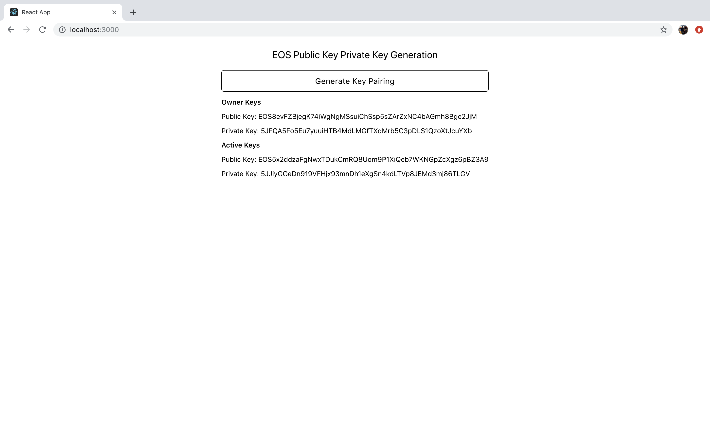

# EOS Public Key Private Key Generator

## 1 | Description

Generates public key, private key pairings for EOS. Uses React, React Native and Node.js Express.




## 2 | Findings

Private keys can be generated using the [`eosjs-ecc` library](https://github.com/EOSIO/eosjs-ecc). This library works on a Node Express server and a React app, however, it is incompatible with React Native.

Another library also exists for generating keys, [`eosjs-keygen`](https://github.com/EOSIO/eosjs-keygen). However, the same problem applies.

To address this issue, to accommodate for react-native, as they key pairing is simply a string, these are generated on a Node server, and pushed to the client. To ensure security, such a server requires SSL.


## 3 | Getting Started


### 3.1 Installation

Clone, then install dependencies in the server and client.

```
cd server
npm install
```

```
cd client
npm install
```

### 3.1 Running

Run the server first, then the client.

Sever:

```
npm run dev
```

Web:

```
npm run web
```

Mobile:

```
npm run start
```
